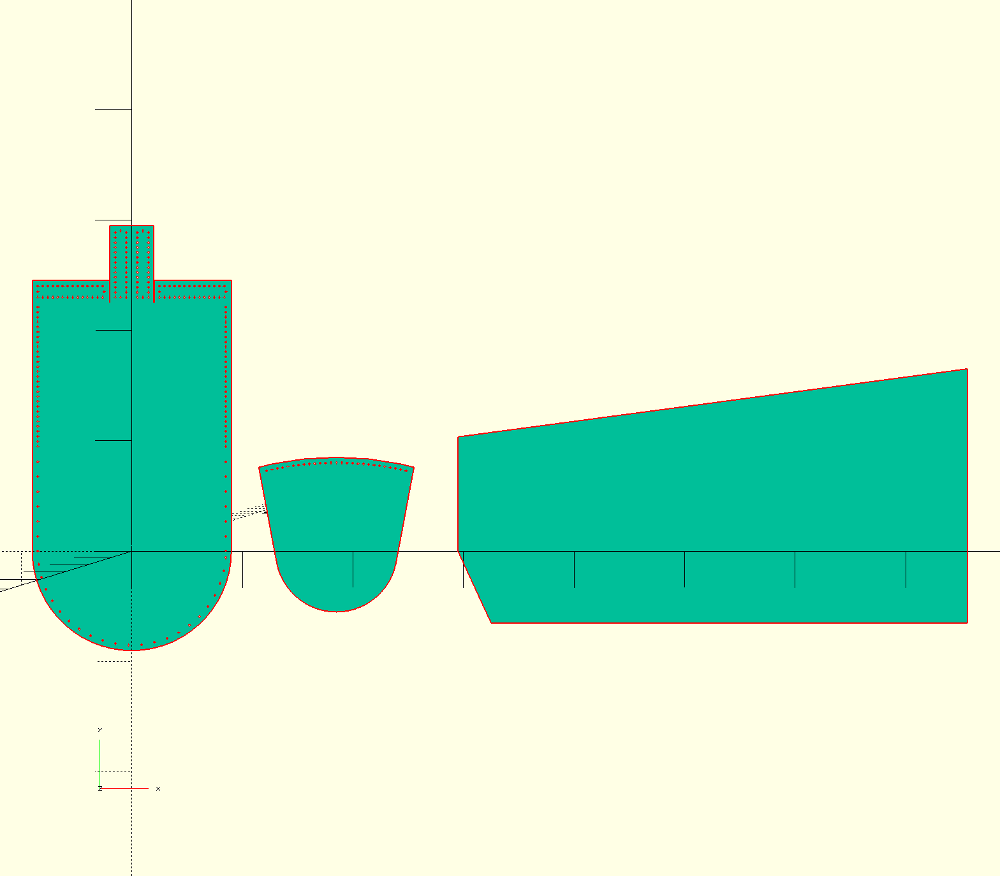

*This is a work in progress. It has not yet been tested against multiple foot measurements. The current math works for the current measurements but I expect there to be errors in scaling*

This is a parametric file for laser cutting a pattern for making Mukluks. Leather & Canvas winter boots good for cold weather - 25f or colder. 

There is a photo build log at https://photos.google.com/share/AF1QipM6YHI1UOmedi9o3jZcWDa1IWZXG11CUrDuz9qp-UBh14g0wY3TEk7trF-SD4BrPw?key=WnBobVZnUFlZSjhtcGZKTTQ2UUxoNEhZdE01MF9B

Output .dwg

