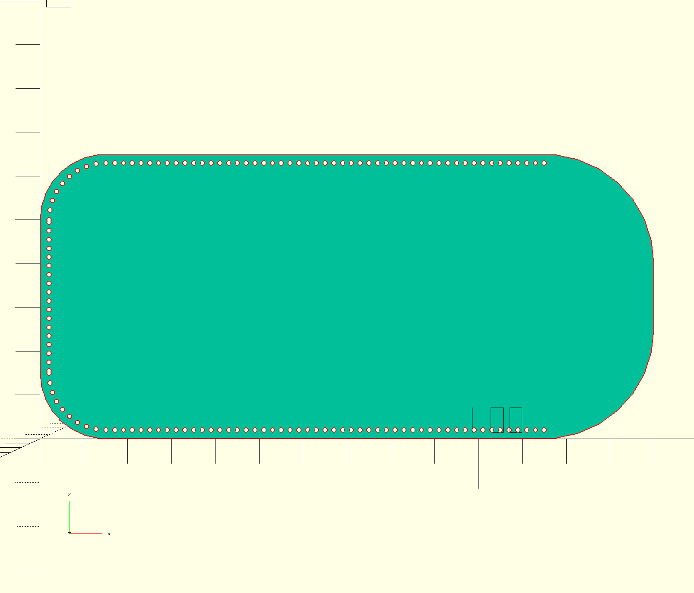

Pen case designed to be laser cut out of leather.

This is a work in process trying to figure out how to use the laser cutter to cut leather.
This is an attempt at being properly parametric, but it's not there yet. 
I want to see if I can engrave the stitch lines into the leather yet.

Youtube Video of what I am attempting to do

