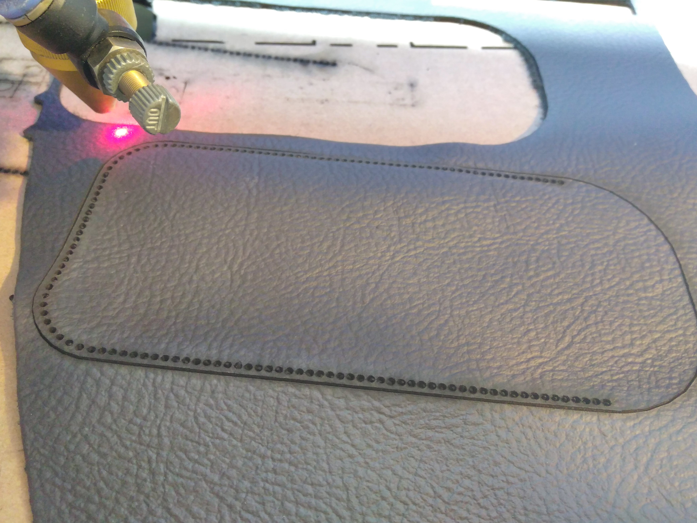
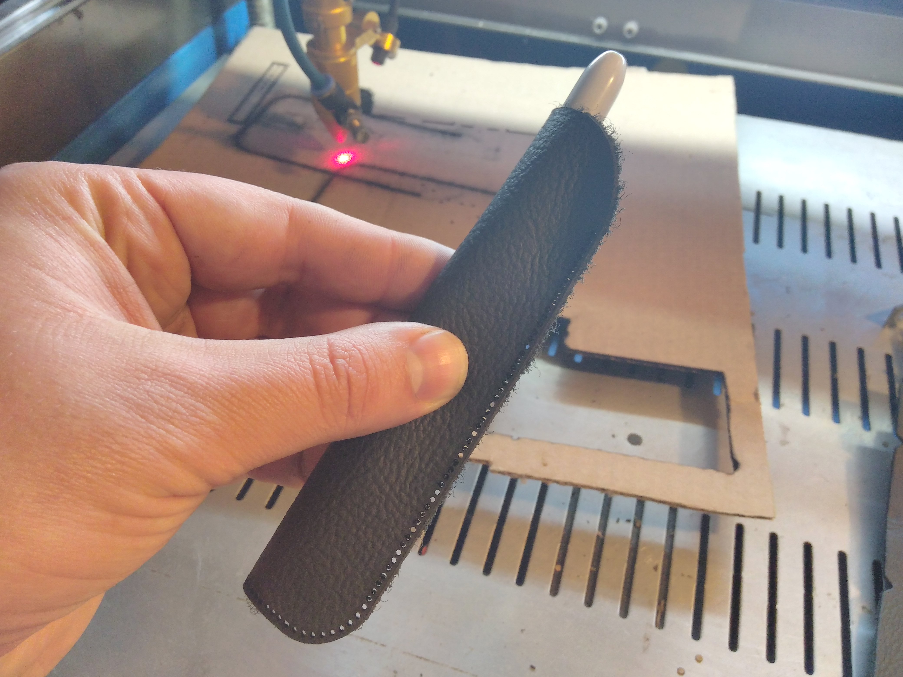

Pen case designed to be laser cut out of leather.

This is a work in process trying to figure out how to use the laser cutter to cut leather.
* This is an attempt at being properly parametric, but it's not there yet. 
 * There is a gap at the transition from the straight lines to the corner
 * This looks like a double-hole at the moment. I am hoping the stitching hides this flaw for now
* I want to see if I can engrave the stitch lines into the leather yet.
* Any emblem will need to be added into the laser cutter software.

Output .dxf

Laser Cut Leather

Pen Case

Youtube Video of what I am attempting to do

